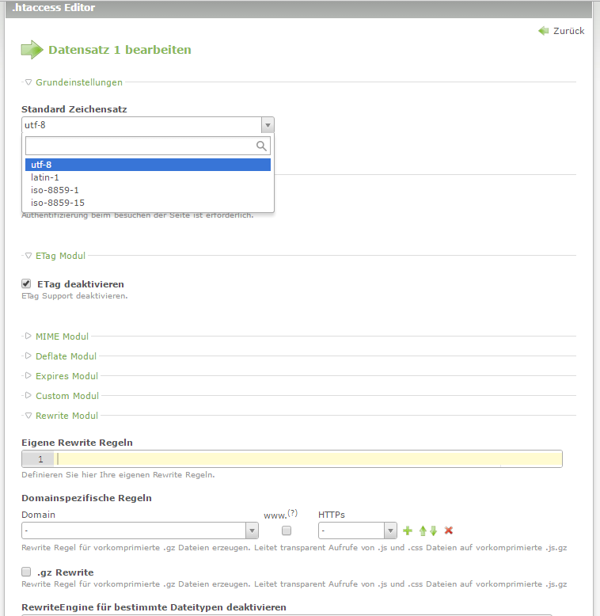

# Contao Extension: hofff.com - Leads encryption

Backend integrated htaccess editor for Contao Open Source CMS.

## Compatibility

- min. Contao version: >= 3.2.0
- max. Contao version: <  3.6.0

## Installation

Install the extension via composer: [hofff/contao-htaccess](https://packagist.org/packages/hofff/contao-htaccess).

If you prefer to install it manually, download the latest release here: https://github.com/hofff/contao-htaccess/releases

## Dependency

There are several dependencies. Please, have a look at the composer.json file.

## Screenshots

